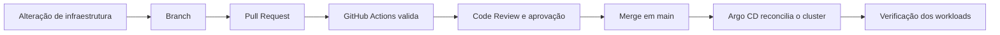
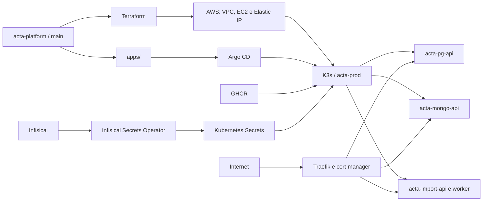

# ☁️ ACTA Platform

Infraestrutura como código e configuração GitOps do ACTA para hospedar, orquestrar e publicar os serviços que sustentam o ciclo **PDCA** (*Plan, Do, Check, Act*).

## 📌 Visão geral

O `acta-platform` centraliza o estado desejado da infraestrutura de produção. O repositório provisiona uma instância EC2 na AWS com Terraform, instala K3s e componentes operacionais, e mantém manifests Kubernetes consumidos pelo Argo CD.

O fluxo separa duas responsabilidades:

1. o Terraform cria a rede, a instância EC2 e o acesso ao cluster;
2. o Argo CD acompanha a pasta [`apps/`](apps/) na branch `main` e reconcilia os workloads no namespace `acta-prod`.

Atualmente, o estado GitOps inclui `acta-pg-api`, `acta-mongo-api`, `acta-import-api` e o worker de importação. As imagens são obtidas do GitHub Container Registry com tags imutáveis baseadas no SHA de cada serviço.

## ✨ Capacidades

- Provisionamento de VPC, subnet pública, tabela de rotas, Security Group, EC2, volume GP3 criptografado e Elastic IP na AWS.
- Instalação de K3s, Argo CD, cert-manager, Helm e Infisical Secrets Operator.
- Orquestração de APIs e worker com Deployments, Services, probes e limites de recursos.
- Exposição HTTPS pelo Traefik com certificados emitidos pelo Let's Encrypt.
- Sincronização GitOps automatizada com `prune` e `selfHeal` pelo Argo CD.
- Entrega de segredos do Infisical para Secrets do Kubernetes sem versionar seus valores no Git.
- Validação de Terraform, Kustomize, schemas Kubernetes e estrutura da Application do Argo CD no GitHub Actions.
- Script PowerShell para conduzir o provisionamento, bootstrap, configuração do GitOps e verificações finais.

## 🛠️ Tecnologias

| Tecnologia | Uso |
| --- | --- |
| AWS | Hospedagem da rede e da instância EC2 |
| Terraform 1.13.3 | Provisionamento da infraestrutura como código |
| Docker e GHCR | Empacotamento e distribuição das imagens dos serviços |
| K3s / Kubernetes | Orquestração dos containers |
| Kustomize | Composição dos manifests do ambiente de produção |
| Argo CD 3.5.2 | Reconciliação GitOps do estado declarado no Git |
| Traefik | Entrada HTTP e HTTPS no cluster |
| cert-manager 1.21.2 | Emissão e renovação de certificados TLS |
| Infisical Secrets Operator 0.10.11 | Sincronização de segredos com o cluster |
| Kubeconform 0.6.7 | Validação dos schemas Kubernetes na CI |
| yq 4.52.1 | Validação estrutural da Application do Argo CD |
| GitHub Actions | Validação contínua da infraestrutura |

## ✅ Pré-requisitos e configuração

Para executar o processo de provisionamento, é necessário ter:

- conta e credenciais AWS com permissão para os recursos definidos no Terraform;
- AWS CLI, Terraform, OpenSSH e `kubectl` disponíveis no PowerShell;
- um EC2 Key Pair existente na região escolhida e sua chave privada local;
- um IPv4 administrativo informado como bloco `/32`;
- credenciais Universal Auth e projeto configurado no Infisical;
- imagens dos serviços publicadas no GHCR.

Crie `infra/aws/terraform.tfvars` somente no ambiente local:

```hcl
aws_region   = "sa-east-1"
key_name     = "nome-do-key-pair"
admin_cidr   = "203.0.113.10/32"
instance_type = "t3.medium"
```

O arquivo `terraform.tfvars`, estados, planos, credenciais AWS e chaves privadas são ignorados pelo Git. Nunca versione esses arquivos.

Os manifests `InfisicalSecret` contêm apenas referências. Os valores reais de banco, Firebase, Cloudinary, Redis e tokens devem permanecer no Infisical.

## 🧪 Validação local

Formate e valide o Terraform sem criar recursos:

```powershell
terraform -chdir=infra/aws fmt -check
terraform -chdir=infra/aws init -backend=false -input=false
terraform -chdir=infra/aws validate
```

Renderize os manifests e confira a estrutura produzida pelo Kustomize:

```powershell
kubectl kustomize apps
```

Esses comandos verificam formatação e configuração estática. Eles não confirmam acesso à AWS, criação dos recursos, sincronização do Argo CD ou saúde das aplicações.

## 🚀 Provisionamento e implantação

> [!CAUTION]
> O processo cria recursos cobráveis na AWS. Revise o `terraform plan`, a conta selecionada, a região e os custos antes de confirmar a aplicação.

Na raiz do repositório, execute:

```powershell
.\infra\aws\deploy.ps1
```

O script:

1. confirma a identidade AWS e executa `terraform init`, `validate` e `plan`;
2. exige a confirmação textual `APLICAR` antes do `terraform apply`;
3. aguarda o SSH e executa [`bootstrap-k3s.sh`](infra/aws/bootstrap-k3s.sh) na EC2;
4. instala K3s, Argo CD, cert-manager e o operador do Infisical;
5. cria o Secret de autenticação do Infisical a partir de entradas interativas;
6. aplica [`argocd/prod.yaml`](argocd/prod.yaml) e ajusta os hosts `sslip.io` ao Elastic IP;
7. aguarda sincronização, workloads e certificados;
8. consulta os endpoints públicos e exibe o estado final.

O kubeconfig obtido do servidor é salvo em `~/.kube/acta-aws.yaml`. A chave privada esperada pelo script fica em `.aws/labsuser.pem`; esse caminho é local e está ignorado pelo Git.

## 🔄 Fluxo GitOps e contribuição



O fluxo esperado para mudanças é:

1. criar uma branch e alterar somente os manifests ou o Terraform necessários;
2. abrir uma Pull Request usando o template do repositório;
3. aguardar a pipeline `teste-infra` e solicitar Code Review;
4. obter a aprovação definida pela equipe antes do merge;
5. após o merge em `main`, acompanhar a reconciliação do Argo CD e verificar os workloads.

O Argo CD usa `prune` para remover recursos excluídos do estado desejado e `selfHeal` para corrigir divergências no cluster. Por isso, alterações manuais em recursos gerenciados podem ser revertidas automaticamente.

## 🧩 Serviços orquestrados

| Componente | Porta | Verificação de disponibilidade |
| --- | ---: | --- |
| `acta-pg-api` | 8080 | `GET /api/v1/health` |
| `acta-mongo-api` | 8081 | `GET /api/v1/health` |
| `acta-import-api` | 8000 | `GET /docs` |
| `acta-import-worker` | — | Processo RQ sem Service HTTP |

Cada workload usa imagem imutável do GHCR, requests e limits de CPU/memória. As APIs possuem probes de inicialização, prontidão e vida configuradas nos respectivos manifests.

## 🔐 Segredos e acesso de rede

- SSH e a API Kubernetes são limitados ao `admin_cidr` configurado.
- HTTP e HTTPS são públicos nas portas 80 e 443.
- A instância exige IMDSv2 e usa volume raiz criptografado.
- As credenciais Universal Auth são criadas diretamente no cluster durante o deploy.
- O Infisical sincroniza os valores para Secrets do namespace `acta-prod` e pode reiniciar os pods quando houver atualização.

O repositório não deve receber chaves PEM, credenciais AWS, arquivos de estado do Terraform ou valores reais de segredos.

## 🏗️ Arquitetura



Terraform prepara a infraestrutura e o cluster. Ele não substitui o Argo CD: o Argo CD é responsável por manter os workloads iguais ao estado versionado em `main`.

## 📁 Estrutura

```text
.
├── .github/workflows/
│   └── teste-infra.yml       # CI de validação da infraestrutura
├── apps/
│   ├── config/               # referências de segredos no Infisical
│   ├── *-api.yaml            # Deployments e Services
│   ├── ingress.yaml          # HTTPS, hosts e certificados
│   └── kustomization.yaml    # agrega o estado de produção
├── argocd/
│   └── prod.yaml             # Application do ambiente acta-prod
├── infra/aws/
│   ├── main.tf               # rede, segurança, EC2 e Elastic IP
│   ├── variables.tf          # entradas e validações do Terraform
│   ├── output.tf             # IP, instância, SSH e URLs
│   ├── deploy.ps1            # orquestra o provisionamento e deploy
│   └── bootstrap-k3s.sh      # instala componentes no cluster
├── PULL_REQUEST_TEMPLATE.md
└── README.md
```

## 🤝 Links e autoria

- [Repositório](https://github.com/AppActa/acta-platform) · [Licença MIT](LICENSE) · `acta.institutojef@gmail.com`
- Contribuições: use *issues* e *pull requests*; há um [`PULL_REQUEST_TEMPLATE.md`](PULL_REQUEST_TEMPLATE.md).
- Autoria: Equipe ACTA.
